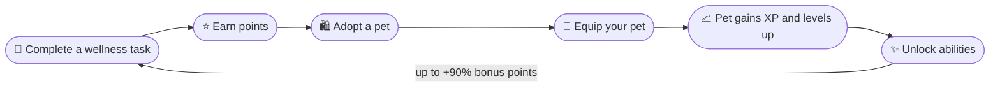
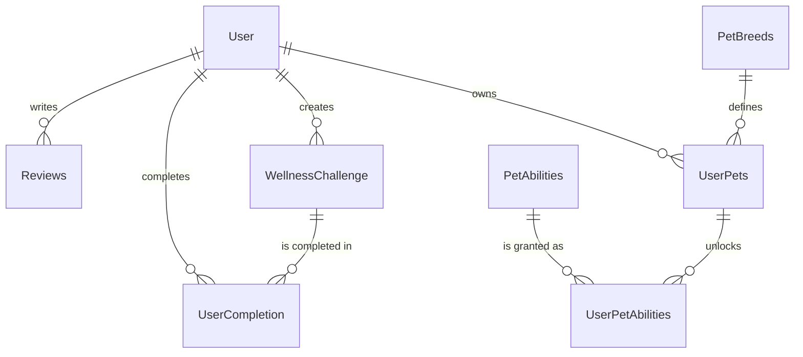

<a id="top"></a>

<div align="center">




# Seville's Home 🐾

**A Cozy Pet Corner - Wellness Challenge Gamification Platform**


<br/>


<br/>

[✨ Features](#features) • [🛠 Tech Stack](#tech-stack) • [🚀 Setup](#installation--setup) • [🔌 API](#api-endpoints) • [📘 Usage](#usage-guide) • [🎨 Credits](#credits)

</div>

---

## 📖 Table of Contents

- [Overview](#overview)
- [Features](#features)
- [Tech Stack](#tech-stack)
- [Project Structure](#project-structure)
- [Database Schema](#database-schema)
- [Installation & Setup](#installation--setup)
- [API Endpoints](#api-endpoints)
- [Usage Guide](#usage-guide)
- [Credits](#credits)
- [Author](#author)
- [License](#license)

---

<a name="overview"></a>
## 🌟 Overview

Seville's Home is a web application that gamifies wellness challenges (or tasks) by allowing users to adopt and raise virtual pets. Complete daily wellness tasks to earn points, adopt adorable pets, level them up, and unlock special abilities that boost your progress!

Seville's Home combines wellness tracking with virtual pet adoption to create an engaging, motivating experience. Users complete wellness challenges to earn points, which they can use to adopt pets from the shop. Equipped pets gain experience and level up as users complete more tasks, eventually unlocking powerful abilities that provide point bonuses.

### 🔁 The Core Loop



### 📊 At a Glance

| 🐾 Pet Breeds | ⚡ Abilities | 📈 Pet Levels | 🎯 Task Rewards | 🎁 Max Bonus |
|:---:|:---:|:---:|:---:|:---:|
| **7** | **5** | **10** | **5 - 250 pts** | **+90%** |

### Key Concepts:
- **Wellness Challenges**: Tasks created by users or the community (e.g., "Drink 2L of water", "Walk 5000 steps")
- **Virtual Pets**: 7 unique pet breeds with different rarity levels and point costs
- **Pet Leveling System**: Pets gain XP when equipped and level up (Level 1-10)
- **Pet Abilities**: Unlock special powers at different levels (1-5) that boost point rewards (10%-90% bonus)
- **Community Features**: Leaderboards, reviews, and shared challenges

<p align="right"><a href="#top">⬆ back to top</a></p>

---

<a name="features"></a>
## ✨ Features

### 🎯 Core Functionality

#### 👤 User Management
- User registration and authentication (JWT-based)
- Profile management with points tracking
- Account creation date tracking
- Secure password hashing (bcrypt)

#### 🌱 Wellness Challenges
- Browse available community challenges
- Create custom wellness tasks with point rewards (5-250 points)
- Complete unique tasks once every 24 hours
- Add comments to completions
- Edit task comments after completion
- View personal completion history
- Delete owned challenges

#### 🐶 Virtual Pet System
- **Pet Shop**: Adopt from 7 unique breeds
  - Happy Hippo (70 pts)
  - Playful Puppy (250 pts)
  - Heroic Platypus (120 pts)
  - Frilly Axolotl (100,000 pts - legendary!)
  - Silly Duck (330 pts)
  - Twilight Bat (560 pts)
  - Clever Rat (410 pts)
  
- **Pet Management**
  - Name/rename your pets
  - Equip one pet at a time
  - View pet level, XP, and breed info
  - Equipped pets gain XP from completed tasks
  - Automatic leveling when XP thresholds are reached

- **Pet Abilities (Power-Ups)**
  - Level 1: Purrfect Purin Heal (+10% points multiplier)
  - Level 2: Sprint Snack Boost (+30% points multiplier)
  - Level 3: Shell Melonpan Sanctuary (+50% points multiplier)
  - Level 4: Backflip Dango Burst (+70% points multiplier)
  - Level 5: Universal Cheer Taiyaki (+90% points multiplier)
  - Abilities stack - highest unlocked ability of equipped pet applies

#### 🏆 Community Features
- **Leaderboard**: Top 5 users by total points earned
- **Pet of the Day**: Most popular adopted breed
- **Reviews System**: 
  - Post reviews with 1-5 star ratings
  - Edit/delete your own reviews
  - One review per 24 hours per user

<p align="right"><a href="#top">⬆ back to top</a></p>

---

<a name="tech-stack"></a>
## 🛠 Tech Stack

<div align="center">


</div>

### Frontend
- **HTML5** - Semantic markup
- **CSS3** - Custom styling with CSS variables
- **Bootstrap 5.3** - Responsive layout framework
- **Vanilla JavaScript** - Client-side interactivity

### Backend
- **Node.js** - Runtime environment
- **Express.js 5.2** - Web application framework
- **MySQL2** - Database driver
- **JWT (jsonwebtoken)** - Authentication tokens
- **bcrypt** - Password hashing

### Database
- **MySQL** - Relational database

### Development Tools
- **nodemon** - Development server with auto-restart
- **dotenv** - Environment variable management
- **Supertest** - HTTP assertion library
- **Playwright** - End-to-end testing

<p align="right"><a href="#top">⬆ back to top</a></p>

---

<a name="project-structure"></a>
## 📁 Project Structure

<details>
<summary><b>Click to expand the full folder tree 🌳</b></summary>

```
BED-CA2-YM-4/
├── index.js                    # Application entry point
├── package.json               # Dependencies and scripts
├── .env                       # Environment variables (not in repo)
├── .gitignore                # Git ignore rules
│
├── assets/
│   └── ascii-pet.svg         # Animated ASCII pet used in the README header
│
├── public/                   # Static frontend files
│   ├── index.html           # Home page with leaderboard
│   ├── login.html           # User login
│   ├── register.html        # User registration
│   ├── profile.html         # User profile & task management
│   ├── tasks.html           # Available & completed tasks
│   ├── pets.html            # My pets collection
│   ├── petShop.html         # Pet & ability shop
│   ├── reviews.html         # Community reviews
│   │
│   ├── css/
│   │   ├── color.css        # Color theme variables
│   │   └── style.css        # Main stylesheet
│   │
│   ├── js/
│   │   ├── queryCmds.js           # Fetch API wrapper
│   │   ├── getCurrentURL.js       # URL helper
│   │   ├── userNavbarToggle.js    # Auth-based navigation
│   │   ├── loginUser.js           # Login functionality
│   │   ├── registerUser.js        # Registration functionality
│   │   ├── getSingleUserInfo.js   # Profile page logic
│   │   ├── getTasks.js            # Tasks page logic
│   │   ├── getMyPets.js           # Pets page logic
│   │   ├── getShop.js             # Shop page logic
│   │   ├── getReviews.js          # Reviews page logic
│   │   └── getLeaderboard.js      # Home page leaderboard
│   │
│   └── images/
│       ├── sprites/         # Pet images (1.png - 7.png)
│       ├── powers/          # Ability icons (1.png - 5.png)
│       ├── bgimg.jpg        # Background image
│       ├── petshop.png      # Shop background
│       ├── polaroidbg.jpg   # Pet of day card background
│       ├── profile.jpg      # Default profile image
│       └── weblogo.png      # Site logo
│
└── src/
    ├── app.js              # Express app configuration
    │
    ├── configs/
    │   ├── createSchema.js    # Database creation script
    │   └── initTables.js      # Table creation & seed data
    │
    ├── services/
    │   └── db.js              # MySQL connection pool
    │
    ├── middlewares/
    │   ├── bcryptMiddleware.js    # Password hashing/comparison
    │   └── jwtMiddleware.js       # Token generation/verification
    │
    ├── models/
    │   ├── userModel.js               # User CRUD operations
    │   ├── wellnessChallengeModel.js  # Challenge operations
    │   ├── userCompletionModel.js     # Task completion operations
    │   ├── userPetsModel.js           # Pet management operations
    │   └── reviewModel.js             # Review operations
    │
    ├── controllers/
    │   ├── authController.js              # Auth examples
    │   ├── userController.js              # User endpoints
    │   ├── wellnessChallengeController.js # Challenge endpoints
    │   ├── userCompletionController.js    # Completion endpoints
    │   ├── userPetsController.js          # Pet endpoints
    │   └── reviewController.js            # Review endpoints
    │
    └── routes/
        ├── mainRoutes.js              # Main router
        ├── userRoutes.js              # User routes
        ├── wellnessChallengeRoutes.js # Challenge routes
        ├── userCompletionRoutes.js    # Completion routes
        ├── userPetsRoutes.js          # Pet routes
        └── reviewRoutes.js            # Review routes
```

</details>

<p align="right"><a href="#top">⬆ back to top</a></p>

---

<a name="database-schema"></a>
## 🗄 Database Schema

### 🗺 Entity Relationship Overview



### Tables

<details>
<summary><b>Click to expand all table definitions 📋</b></summary>

#### User
Stores user account information
```sql
- user_id (PK, AUTO_INCREMENT)
- username (UNIQUE)
- email (UNIQUE)
- password (hashed)
- created_on (TIMESTAMP)
- updated_on (TIMESTAMP)
- last_login_on (TIMESTAMP)
- points (INT, default 0)
- equipped_pet_id (FK to UserPets, nullable)
```

#### WellnessChallenge
Stores wellness tasks/challenges
```sql
- challenge_id (PK, AUTO_INCREMENT)
- creator_id (FK to User)
- description (TEXT)
- points (INT, 5-250)
```

#### UserCompletion
Tracks task completions
```sql
- completion_id (PK, AUTO_INCREMENT)
- challenge_id (FK to WellnessChallenge)
- user_id (FK to User)
- details (TEXT, optional comment)
- completed_at (TIMESTAMP)
```

#### PetBreeds
Catalog of available pet types
```sql
- breed_id (PK, AUTO_INCREMENT)
- breed_name (VARCHAR)
- description (TEXT)
- required_points (INT)
```

#### UserPets
User-owned pet instances
```sql
- user_pet_id (PK, AUTO_INCREMENT)
- user_id (FK to User)
- breed_id (FK to PetBreeds)
- pet_name (VARCHAR)
- pet_level (INT, 1-10)
- experience_points (INT)
```

#### PetAbilities
Catalog of unlockable abilities
```sql
- ability_id (PK, AUTO_INCREMENT)
- ability_name (VARCHAR)
- description (TEXT)
- required_level (INT, 1-5)
```

#### UserPetAbilities
Tracks unlocked abilities per pet
```sql
- user_pet_ability_id (PK, AUTO_INCREMENT)
- user_pet_id (FK to UserPets)
- ability_id (FK to PetAbilities)
- unlocked_at (TIMESTAMP)
- UNIQUE(user_pet_id, ability_id)
```

#### PetLevelSystem
XP requirements for each level
```sql
- level_id (PK, AUTO_INCREMENT)
- level (INT, 1-10)
- xp_required (INT)
- description (TEXT)
```

#### Reviews
Community reviews
```sql
- id (PK, AUTO_INCREMENT)
- name (VARCHAR)
- review_amt (INT, 1-5 stars)
- description (TEXT)
- user_id (FK to User)
- created_at (TIMESTAMP)
```

</details>

### Key Relationships
- One User can have many Pets
- One User can have one equipped Pet
- One Pet can have many Abilities
- One User can complete many Challenges
- One Challenge can have many Completions

<p align="right"><a href="#top">⬆ back to top</a></p>

---

<a name="installation--setup"></a>
## 🚀 Installation & Setup

### Prerequisites
- Node.js (v18 or higher)
- MySQL (v8.0 or higher)
- npm or yarn package manager

### Step 1: Clone the Repository
```bash
git clone <repository-url>
cd BED-CA2-YM-4
```

### Step 2: Install Dependencies
```bash
npm install
```

### Step 3: Configure Environment Variables
Create a `.env` file in the root directory:

```env
# Database Configuration
DB_HOST=localhost
DB_USER=root
DB_PASSWORD=your_password_here
DB_DATABASE=pet
DB_SSL_REJECT_AUTHORISE=false

# JWT Configuration
JWT_SECRET_KEY=your_secret_key_here
JWT_EXPIRES_IN=3600
JWT_ALGORITHM=HS256
```

### Step 4: Initialize Database
Run these commands in order:

```bash
# Create database schema
node src/configs/createSchema.js

# Create tables and seed initial data
node src/configs/initTables.js 
or
npm run init_tables
```

This will create:
- 5 test users (password: '1234' for all)
- 6 sample wellness challenges
- 8 task completions
- 7 pet breeds
- 5 pet abilities
- 7 user-owned pets
- 10 level tiers
- 21 unlocked abilities
- 3 sample reviews

### Step 5: Start the Server

**Development mode** (with auto-reload):
```bash
npm run dev
```

**Production mode**:
```bash
node index.js
```

The server will start on `http://localhost:3000`

### Step 6: Access the Application
Open your browser and navigate to:
```
http://localhost:3000
```

<p align="right"><a href="#top">⬆ back to top</a></p>

---

<a name="api-endpoints"></a>
## 🔌 API Endpoints

> 💡 Click each group below to expand its endpoints.

<details>
<summary><b>🔐 Authentication</b> (2 endpoints)</summary>

| Method | Endpoint | Description | Auth Required |
|--------|----------|-------------|---------------|
| POST | `/api/register` | Register new user | No |
| POST | `/api/login` | Login user | No |

</details>

<details>
<summary><b>👤 Users</b> (5 endpoints)</summary>

| Method | Endpoint | Description | Auth Required |
|--------|----------|-------------|---------------|
| GET | `/api/users` | Get all users | No |
| GET | `/api/users/:id` | Get user by ID | Yes |
| POST | `/api/users` | Create user | No |
| PUT | `/api/users/:id` | Update user | Yes |
| DELETE | `/api/users/:id` | Delete user | Yes |

</details>

<details>
<summary><b>🌱 Wellness Challenges</b> (5 endpoints)</summary>

| Method | Endpoint | Description | Auth Required |
|--------|----------|-------------|---------------|
| GET | `/api/challenges` | Get all challenges | No |
| POST | `/api/challenges` | Create challenge | Yes |
| PUT | `/api/challenges/:id` | Update challenge | Yes (Owner) |
| DELETE | `/api/challenges/:id` | Delete challenge | Yes (Owner) |
| GET | `/api/challenges/creator/:userId` | Get user's created challenges | Yes |

</details>

<details>
<summary><b>✅ Task Completions</b> (5 endpoints)</summary>

| Method | Endpoint | Description | Auth Required |
|--------|----------|-------------|---------------|
| POST | `/api/challenges/:id` | Complete a challenge | Yes |
| GET | `/api/challenges/:id` | Get completions by challenge | No |
| GET | `/api/challenges/users/:userId` | Get user's completions | Yes |
| PUT | `/api/challenges/:id/edit` | Edit completion comment | Yes |
| GET | `/api/challenges/users/:userId/power-bonus` | Get user's power bonus | Yes |

</details>

<details>
<summary><b>🐾 Pets</b> (7 endpoints)</summary>

| Method | Endpoint | Description | Auth Required |
|--------|----------|-------------|---------------|
| GET | `/api/pets` | Get all user pets | No |
| GET | `/api/users/:id/pets` | Get a user's pets | Yes |
| GET | `/api/pets/:userPetId` | Get pet by ID | Yes |
| POST | `/api/users/:userId/adopt/pets/:breedId` | Adopt new pet | Yes |
| PUT | `/api/users/:userId/pets/:userPetId` | Update pet info | Yes |
| PUT | `/api/users/:userId/equip-pet/:userPetId` | Equip pet | Yes |
| PUT | `/api/users/:userId/unequip-pet` | Unequip pet | Yes |

</details>

<details>
<summary><b>⚡ Pet Breeds & Abilities</b> (5 endpoints)</summary>

| Method | Endpoint | Description | Auth Required |
|--------|----------|-------------|---------------|
| GET | `/api/breeds` | Get all pet breeds | No |
| GET | `/api/breeds/:id` | Get breed by ID | No |
| GET | `/api/abilities` | Get all abilities | No |
| GET | `/api/pets/:userPetId/abilities` | Get a pet's abilities | Yes |
| POST | `/api/users/:userId/unlock/pets/:userPetId/ability/:abilityId` | Unlock ability | Yes |

</details>

<details>
<summary><b>🏆 Community</b> (2 endpoints)</summary>

| Method | Endpoint | Description | Auth Required |
|--------|----------|-------------|---------------|
| GET | `/api/leaderboard` | Get top 5 users | No |
| GET | `/api/top-pet` | Get most popular pet | No |

</details>

<details>
<summary><b>⭐ Reviews</b> (5 endpoints)</summary>

| Method | Endpoint | Description | Auth Required |
|--------|----------|-------------|---------------|
| GET | `/api/review` | Get all reviews | No |
| GET | `/api/review/:id` | Get review by ID | No |
| POST | `/api/review` | Create review (1 per 24h) | Yes |
| PUT | `/api/review/:id` | Update review | Yes (Owner) |
| DELETE | `/api/review/:id` | Delete review | Yes (Owner) |

</details>

<p align="right"><a href="#top">⬆ back to top</a></p>

---

<a name="usage-guide"></a>
## 📘 Usage Guide

### Getting Started

1. **Register an Account**
   - Navigate to the Register page
   - Fill in username, email, and password
   - You'll start with 0 points and no pets

2. **Complete Your First Task**
   - Go to the Tasks page
   - Browse available wellness challenges
   - Click "Mark as Completed" on a task
   - Add an optional comment
   - Earn points!

3. **Adopt Your First Pet**
   - Visit the Pet Shop
   - Click "ENTER" on the Pet Shop
   - Adopt a pet of your choice!
   - Name your new companion

4. **Equip Your Pet**
   - Go to "My Pets" from the navigation
   - Click "Equip" on your new pet
   - Your pet will now gain XP when you complete tasks!

5. **Level Up & Unlock Abilities**
   - Complete more tasks while your pet is equipped
   - Watch your pet gain XP and level up
   - Visit the Abilities Canopy in the Pet Shop
   - Unlock new powers at different levels
   - Enjoy point bonuses on future completions!

### Progression Tips

- **Daily Routine**: Complete tasks daily to maximize XP gain
- **Strategic Pet Selection**: Higher-cost pets often have better stats
- **Ability Priority**: Unlock higher-level abilities ASAP for better bonuses
- **Task Creation**: Create high-value tasks (250 pts) for yourself and others
- **Pet Collection**: Try to collect all 7 breeds!

### Power Bonus System

When you have an equipped pet with unlocked abilities:
- Your highest-level unlocked ability determines your bonus
- Bonuses range from +10% to +90% extra points
- Example: A task worth 100 points becomes 190 with max bonus!
- Level up your pet and unlock all 5 abilities for maximum (+90%) gains

| Ability Level | Ability | Bonus | 100-pt Task Becomes |
|:---:|---|:---:|:---:|
| 1 | Purrfect Purin Heal | +10% | 110 |
| 2 | Sprint Snack Boost | +30% | 130 |
| 3 | Shell Melonpan Sanctuary | +50% | 150 |
| 4 | Backflip Dango Burst | +70% | 170 |
| 5 | Universal Cheer Taiyaki | +90% | 190 |

<p align="right"><a href="#top">⬆ back to top</a></p>

---

<a name="credits"></a>
## 🎨 Credits

### Art Assets
- **Pet Sprites**: [Artist, Spicy Mochi](https://www.spicymochi.com/portfolio.html)
- **Power-up Icons**: [b0tfly on itch.io](https://b0tfly.itch.io/)
- **Background Image**: Studio Goindol (South Korea)
- **Polaroid Background**: [Artist, Evelyn Tan](https://www.evelyntan.net/)

### Technologies
- Built with Express.js and MySQL
- Frontend powered by Bootstrap 5
- Authentication via JWT
- Secure password hashing with bcrypt

### README Extras
- Banner and footer by [capsule-render](https://github.com/kyechan99/capsule-render)
- Typing animation by [readme-typing-svg](https://github.com/DenverCoder1/readme-typing-svg)
- Badges by [Shields.io](https://shields.io)

---

<a name="author"></a>
## 👩‍💻 Author

[](https://github.com/ym-4)

---

<a name="license"></a>
## 📄 License

This project is created as an educational assignment for BED CA2.

**© 2026 Seville's Home - All Rights Reserved**

---

<div align="center">

**Happy Pet Raising! 🐾**


</div>
